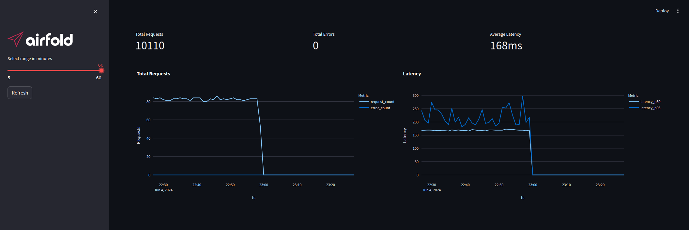

# API Analytics Template for Airfold

Simple analytics for API callers: latency and error rate. Can be used as a starting point for other Airfold projects.



## Repository Structure

The structure of this repository is:

- `./airfold` - Airfold pipeline definitions
- `./dashboard.py` - Streamlit dashboard that displays the data
- `./main.py` - Example app that sends API events to Airfold
- `./github/workflows/deploy.yaml` - Typical workflow for CI/CD

## Installation

To install the project, run the following commands:

```shell
git clone api-analytics-template
cd api-analytics-template
pip install -r requirements.txt
```

## Create Pipeline in Airfold

To set up your Airfold pipeline, follow these steps:

1. Obtain an Admin key from your Airfold Workspace.
2. Set it up in the Airfold CLI:

```shell
af config
```

When prompted, enter the API URL and Admin key:

```plaintext
Configuring for API URL: https://api.airfold.co
? Api key: **************

🚀 Config successfully set up!
You can manually modify it in: '/home/user/api-analytics-template/.airfold/config.yaml'
```

3. Push the pipeline:

```shell
af push ./airfold
```

## Ingest Data and Display It

1. Send some events from the main app:

```shell
AIRFOLD_API_KEY=aft_XXXXX python main.py
```

2. Launch the dashboard:

```shell
AIRFOLD_API_KEY=aft_XXXXX streamlit run dashboard.py
```

## CI/CD Integration Example

This repository contains a `deploy` CI/CD pipeline that will dry-run your Airfold project on PRs 
and deploy the project upon merging to `main`.

It will also create PR comments reporting CI/CD progress or failures.
